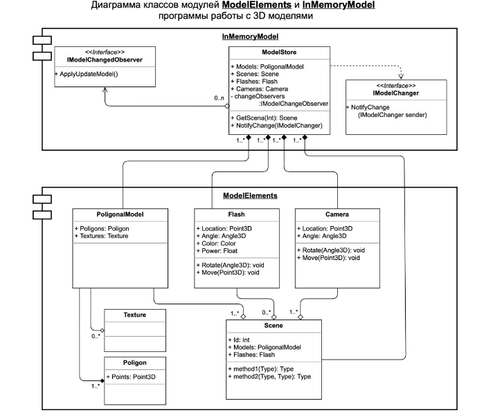

<h2 class="title">"Урок 1. Введение в понятие архитектуры, проектирование ПО и жизненный цикл программного продукта. UML-диаграммы"</h3>

<h3>Урок 1. Введение в понятие архитектуры, проектирование ПО и жизненный цикл программного продукта. UML-диаграммы</h3>

<h4>Задание 1. На основе диаграммы классов написать код, без реализации методов(конструкторы нужно написать)</h4>

<h4>Диаграмма:</h4>

